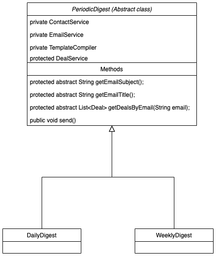

# Email Digest Exercise
## Overview
I have implemented the digest service using Template Design Pattern (TDP), because of the following reasons:
- Daily digest, Weekly digest or even any Periodic Digest (Monthly, Yearly) is using the same algorithm for sending emails to contacts, the only difference is the email subject, email title, and the call to the Deal service, and using TDP in this case will maximize the `Don't Repeat Yourself Design Principle`
- I want to make the code open for extension closed for modification so I abstract all the similar logic in the abstract class and name it `PeriodicDigest`, then I abstract the differences by using three abstract methods that should be implemented by the sub-classes (DailyDigest, WeeklyDigest).
Then given a new future requirement for monthly digest for example, will be done simply by adding a new class called MonthlyDigest that extends PeriodicDigest and implement the abstract methods.
Here is a code snippet from the `PeriodicDigest` class.
```Java
    public void send() {
        String emailSubject = getEmailSubject();
        String title = getEmailTitle();

        try {
            var pagesIterator =  contactService.getPaginatedContacts(PAGE_SIZE);
            while (pagesIterator.hasNext()) {
                List<Contact> contactsPage = pagesIterator.next();
                for (Contact contact : contactsPage) {
                    List<Deal> deals = getDealsByEmail(contact.getEmail());
                    Digest digest = new Digest(title, contact, deals);
                    String emailBody = compiler.compile("templates/digest.mustache", digest);
                    Email email = new Email(emailSubject, emailBody);
                    emailService.sendEmail(email, contact.getEmail());
                }
            }
        } catch (Exception e) {
            log.error("Error while trying to send the digests", e);
        }
    }
    protected abstract String getEmailTitle();

    protected abstract String getEmailSubject();

    protected abstract List<Deal> getDealsByEmail(String email);
```
- I have used mustache (a Logic-less template engine) for building the emails templates. all the templates are in this [folder](./src/main/resources/templates)
## Class Diagram



## What could be improved
- I need to add a circle ci configuration file that will do the following:
  - Run the test suite on each commit to whatever branch
  - Build the project as a docker image and push this image to some docker registry like docker hub for example, with assumption that we are deploying our apps using containers in production.
  - I have did that in a different project of mine you can take a look at it from this [link](https://github.com/Motaz-Al-Zoubi/auth-microservice), this project is built on NodeJs.
- I would add [JaCoCo Java Code Coverage Library](https://www.eclemma.org/jacoco/) that will measure the code coverage of the test suite and make sure that the code coverage is more than **95%**, then add this check to circle ci.

## The Bonuses

Given that huge scale, there are some concerns on the current design that we need to handle:
- Email services usually has some sort of rate limiting then it will not allow us to send that huge amount of emails within small window time.
- Having the same code I have implemented here will not work efficiently for that huge scale, because it will take so much time for the sequential execution that could not be executed in parallel in the current design, and it may has problems with the machine that will run the code because of the limitation of the machine's resources.
- If failure happens (which will happen for sure :D) the current architecture doesn't support any sort of retry mechanisms then that could make a negative impact to our clients because they are not receiving their digest.
- The current schedular sleeps all the day and then at specific time wakes up and send all the emails at once, however, a better approach is to utilize the whole day (assuming that the bushiness doesn't have a concern regarding in which specific time of the day we need to send the digest)

### The right approach for handling this huge scale (For simplicity I will talk about daily digest, and of course weekly should be handled the same)
I will build two micro-services so that I can scale them **independently**.
- Scheduler micro-service (Publisher)
  This service is only responsible for running **each minute of the day** and use the contacts service to get a page from the contacts, loop over it and for each contact send a message to a message broker like (`Kafka`, `Amazon SQS`, `Google PubSub`), this message will contain the needed information to send a digest to a specific destination.
- Notification micro-service (Subscriber)
  This service is responsible for consuming the messages from the message broker and do the actual digest sending, in this scenario if a failure happens then simply the message broker will retry as long as it doesn't receive an acknowledgment from the consumer. (Which means more reliability and fault tolerance).

#### What is the value of having Notification micro-service?
- Let us assume that the message broker has over-load of messages then simply we can deploy multiple instances of the Notification micro-service to handle that load, which means more scalability.
- If we are using Google PubSub and Google App Engine as an infrastructure then I will use the Push mechanism for the google PubSub that will push the messages it has to a webhook, and this webhook is part of the Notification micro-service and deployed as an AppEngine service that could automatically scale up or down according to the traffic on this webhook. (Which will optimize the cost).

#### How the Scheduler micro-service will know the page index for each minute of the day?
This simply could be done using `Redis` as caching for the last page index that we have scheduled before.

#### Why do we run Scheduler micro-service per each minute of the day?
That will distribute the load through out the minutes of the day instead of pushing all the data at certain minute of the day which will not be applicable given the current scale.

#### System Architecture Diagram

